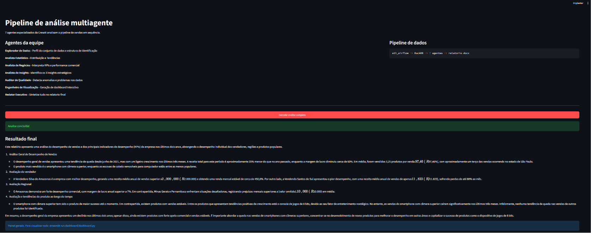
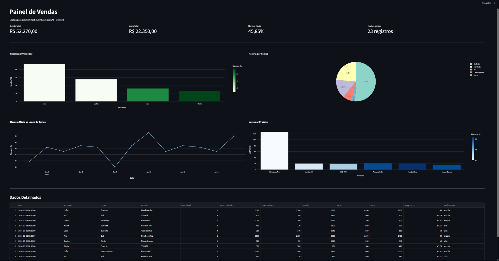

# `Multi-Agent Analytics Pipeline`

> Sistema multi-agente com CrewAI e Ollama que orquestra 7 agentes especializados para analisar dados de vendas, gerar insights estratégicos e exibir resultados em um dashboard interativo com Streamlit e Plotly.

---

## `Tecnologias`


---

## `O que faz`

Recebe dados de vendas processados pelo pipeline [`etl_airflow`](https://github.com/Arthur-Baptista-dos-Santos/etl_airflow) e orquestra 7 agentes de IA especializados em sequência. Cada agente tem um papel distinto, acessa o banco DuckDB com ferramentas reais e passa seu output como contexto para o próximo. O pipeline encerra com um relatório executivo consolidado e um dashboard visual interativo com KPIs e gráficos em tempo real.

---

## `Fluxo dos agentes`

```
DuckDB (vendas.db)
    Explorador de Dados          - perfila o dataset: registros, colunas, datas
        Analista Estatístico     - calcula distribuicoes, medias e tendencias
            Analista de Negócios - interpreta KPIs por vendedor e regiao
                Analista de Insights - identifica os 3 insights estratégicos
                    Auditor de Qualidade - verifica nulos, anomalias e consistencia
                        Engenheiro de Visualizacao - descreve o dashboard ideal
                            Redator Executivo - sintetiza tudo em relatorio executivo
```

---

## `Arquitetura`

```
agente_multi/
├── src/
│   ├── ferramentas.py   # 3 ferramentas com @tool decorator (CrewAI)
│   ├── agentes.py       # 7 agentes com role, goal e backstory
│   ├── tarefas.py       # 7 tarefas com description e expected_output
│   └── equipe.py        # Crew com Process.sequential + funcao executar()
├── dashboard/
│   └── dashboard.py     # Dashboard Streamlit com Plotly (4 KPIs + 4 graficos)
├── relatorios/          # Relatórios gerados (gitignored)
├── app.py               # Interface Streamlit principal
├── requirements.txt
├── .gitignore
└── README.md
```

---

## `Ferramentas dos agentes`

| Ferramenta | Agentes que usam | O que faz |
|---|---|---|
| `Ler dados do banco` | Explorador, Estatístico, Insights, Redator | Lê todas as vendas do DuckDB em CSV |
| `Calcular KPIs de vendas` | Negócios, Insights, Visualizacao, Redator | Calcula receita, lucro e margem por vendedor e região |
| `Verificar qualidade dos dados` | Auditor | Conta nulos, registros removidos e inconsistências |

---

## `Resultados`

| Vendedor | Vendas | Receita | Lucro | Margem Média |
|---|---|---|---|---|
| João | 6 | R$ 23.650,00 | R$ 9.810,00 | 44,42% |
| Carlos | 6 | R$ 13.870,00 | R$ 5.750,00 | 44,42% |
| Ana | 5 | R$ 8.120,00 | R$ 3.620,00 | 46,97% |
| Maria | 6 | R$ 6.630,00 | R$ 3.170,00 | 47,76% |

Receita total: R$ 52.270,00 - Lucro total: R$ 22.350,00 - Margem média: 45,85%

---

## `Pré-requisitos`

- Python 3.10+
- Ollama instalado com `mistral` disponível
- Pipeline [`etl_airflow`](https://github.com/Arthur-Baptista-dos-Santos/etl_airflow) executado ao menos uma vez

---

## `Como rodar`

```bash
git clone https://github.com/Arthur-Baptista-dos-Santos/agente_multi.git
cd agente_multi

python -m venv .venv
.venv\Scripts\activate

pip install -r requirements.txt
```

```bash
# Garanta que o Ollama esta rodando com o modelo disponivel
ollama pull mistral

# Interface principal - executa os 7 agentes em sequencia
streamlit run app.py

# Em outro terminal - dashboard visual interativo
streamlit run dashboard/dashboard.py --server.port 8502
```

Acesse `http://localhost:8501`, clique em **Executar análise completa** e aguarde os 7 agentes processarem. O dashboard estara disponível em `http://localhost:8502`.

---

## `Orquestração da equipe`

```python
equipe = Crew(
    agents=[explorador, estatistico, analista_negocio, analista_insights,
            auditor_qualidade, visualizador, redator],
    tasks=[tarefa_explorar, tarefa_estatistica, tarefa_negocio, tarefa_insights,
           tarefa_qualidade, tarefa_dashboard, tarefa_relatorio],
    process=Process.sequential,
)
```

`Process.sequential` garante que cada agente recebe o output dos anteriores como contexto acumulado antes de executar sua tarefa.

---

## `Conceitos aplicados`

- **`Multi-Agent System`**: múltiplos agentes com papéis distintos colaborando em sequência para resolver um problema complexo
- **`CrewAI`**: framework de orquestração multi-agente com Agent, Task e Crew
- **`Process.sequential`**: cada agente recebe o output do anterior como contexto acumulado
- **`@tool decorator`**: transforma funções Python em ferramentas que o LLM pode chamar autonomamente
- **`Role, Goal, Backstory`**: identidade do agente que guia o raciocínio e o tom das respostas
- **`Ollama`**: inferência local de LLMs sem custo de API e com privacidade total dos dados
- **`DuckDB`**: banco analítico embutido como fonte de verdade para todos os agentes
- **`Streamlit + Plotly`**: dashboard interativo com KPIs e gráficos em tempo real a partir de dados reais

---

## `Demonstração`

**Pipeline dos 7 agentes**: os agentes executam em sequência, cada um recebendo o output do anterior como contexto. O Redator Executivo sintetiza tudo em relatório final com análise de desempenho, avaliação regional e tendências.



---

**Dashboard interativo**: gerado automaticamente pelo pipeline com 4 KPIs (R$ 52.270 de receita, 45.85% margem média), receita por vendedor, distribuição regional, margem ao longo do tempo e lucro por produto.



---

## `Licença`

Distribuído sob a licença MIT. Veja [LICENSE](LICENSE) para mais informações.

---

## `Autor`

**Arthur Baptista dos Santos**
RM 565346 · Inteligência Artificial · FIAP 2025-2026

[](https://linkedin.com/in/arthur-baptista-dos-santos)
[](https://github.com/Arthur-Baptista-dos-Santos)
